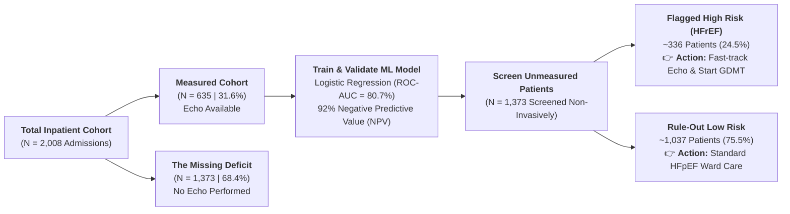

# 🫀 CardioPulse Analytics: Clinical Decision Support & Inpatient Heart Failure Intelligence

**Python Hackathon — September 2026**  
**Team 08:** Python Ninjas  
**Cohort:** Zigong Fourth People's Hospital Inpatient Heart Failure Cohort ($N = 2,008$ Patients, 168 Clinical Attributes)

---

## 📌 Executive Summary & Clinical Value

Heart failure (HF) is the single leading cause of emergency hospitalization, unplanned 30-day readmissions, and inpatient mortality worldwide. Hospitalized heart failure patients require rapid, precise clinical decisions within the first **2 hours of admission** to preserve myocardial tissue, prevent cardiorenal collapse, and avoid acute respiratory arrest.

**CardioPulse Analytics** is an end-to-end clinical intelligence and bedside Clinical Decision Support System (CDSS) built by **Team Python Ninjas**:
1. **Category 1 :** Zero-Leakage Preprocessing & Clinical Range Validation (`8_Python_Ninjas_1.Cleaning.ipynb`)
2. **Category 2 :** 10 Descriptive Demographics & Inpatient Cohort Insights (`8_Python_Ninjas_2.Descriptive.ipynb`)
3. **Category 3 :** 30 Prescriptive Multivariate Statistical Proofs (`8_Python_Ninjas_3.Prescriptive.ipynb`)
4. **Category 4 :** Master 10-Hypothesis Machine Learning Predictive Suite (`8_Python_Ninjas_4.Predictive.ipynb`)
5. **Category 5 :** Interactive Bedside CDSS Simulator & 8-Module Dashboard (`8_Python_Ninjas_5_Dashboard.py` & `app.py`)

---

## 🗂️ Project Repository Structure

```
├── 8_Python_Ninjas_1.Cleaning.ipynb        # Category 1: Zero-Leakage Preprocessing & Range Validation (100 pts)
├── 8_Python_Ninjas_2.Descriptive.ipynb     # Category 2: 10 Descriptive Cohort Demographics (50 pts)
├── 8_Python_Ninjas_3.Prescriptive.ipynb    # Category 3: 30 Multivariate Statistical Proofs & Hypotheses (600 pts)
├── 8_Python_Ninjas_4.Predictive.ipynb      # Category 4: Master 10-Hypothesis ML Suite (8 Models each + SHAP) (900 pts)
├── 8_Python_Ninjas_5_Dashboard.py          # Category 5: Streamlit Interactive Bedside CDSS Dashboard (100 pts)
├── app.py                                 # Category 5: Streamlit App Entry Point
├── 8_Python_Ninjas_cleaned_data.csv       # Verified Zero-Leakage Inpatient Dataset (N = 2,008 Admissions)
├── 8_Python_Ninjas_models.joblib          # Pre-Compiled 10-Model Serialization Bundle for Live Inference
├── README.md                              # Comprehensive Project Documentation & Setup Guide
└── requirements.txt                       # Python Dependencies
```

---

## 🧭 Streamlit CDSS Dashboard Architecture (8 Navigation Modules)

The interactive dashboard ([`8_Python_Ninjas_5_Dashboard.py`](file:///c:/Users/supri/Numpy_Ninja_Python_Hackathon/My%20rough%20notes/back%20up%20predictive%20till/8_Python_Ninjas_5_Dashboard.py) / [`app.py`](file:///c:/Users/supri/Numpy_Ninja_Python_Hackathon/My%20rough%20notes/back%20up%20predictive%20till/app.py)) is organized into 8 structured modules accessible via the sidebar:

### 1. 🏠 Overview
* **Tab 1: 🌟 Executive Problem Solving:** Outlines the core clinical dilemmas addressed by CardioPulse Analytics (Echo Deficit, Mortality Triage, Cardiorenal Syndrome, Respiratory Crisis, Readmission Penalties).
* **Tab 2: 💰 Hospital ROI Calculator:** Dynamic financial and clinical ROI model calculating echocardiogram cost savings, ICU bed optimization, readmission fine avoidance, and estimated lives saved.
* **Tab 3: 📊 Cohort Outcome Prevalence:** High-level summary metrics of all 10 clinical endpoints across the 2,008 inpatient cohort.

### 2. 🧹 Data Cleaning & Zero-Leakage
* **Tab 1: 🛡️ Zero-Leakage Architecture:** Explains the 5 pillars of data integrity (Strict Fold Isolation, Physiological Boundary Clipping, Categorical Normalization, Target Integrity, and Outlier Handling).
* **Tab 2: 📋 Data Quality Audit Trail & Distributions:** Interactive visualization of pre- vs. post-cleaning distributions, missingness matrices, and normalization verification.

### 3. 📊 Descriptive Cohort Demographics
* **Tab 1: 👥 Cohort Distributions:** Age, gender, admission pathways, vital signs, and key baseline biomarkers.
* **Tab 2: 🫀 NYHA vs. Mortality:** Cross-tabulation of New York Heart Association functional classification against 28-day and 6-month mortality rates.
* **Tab 3: ⏱️ Length of Stay (LOS):** Inpatient duration analysis segmented by admission severity and outcome groups.
* **Tab 4: 🩺 Comorbidity Heatmap:** Clinical co-occurrence patterns of hypertension, diabetes, CKD, COPD, and ischemic heart disease.

### 4. 🔬 Prescriptive Multivariate Proofs
* **Tab 1: 🗺️ Interactive Correlation Matrix:** High-resolution Spearman rank correlation heatmap across cardiac, renal, electrolyte, and hematologic biomarkers.
* **Tab 2: 🧪 Top 5 Validated Hypotheses:** Interactive visual deep-dives for the top prescriptive proofs with exact test statistics and Chance of Randomness ($p$-values).

### 5. 🤖 Master 10-Hypothesis ML Suite (Predictive)
* **Tab 1: 🏆 Master Leaderboard:** Full comparison table across all 10 clinical endpoints with ROC-AUC, Precision, Recall, F1-score, and statistical gain over single-biomarker baselines.
* **Tab 2: 📈 ROC-AUC Curves vs. Baselines:** Side-by-side ROC curves comparing multi-variable ML models against standard clinical benchmarks (BNP, Killip, Urea, Troponin).
* **Tab 3: 🤖 8 Classifiers per Hypothesis:** Comprehensive model comparison detailing performance for Logistic Regression, Gaussian NB, KNN, Random Forest, Decision Tree, MLP Neural Network, XGBoost, and Linear SVM.

### 6. 🎯 Hypothesis 1: Non-Invasive Identification of HFrEF (LVEF ≤ 40%) Without an Echocardiogram
* **Tab 1: 💡 The Big Problem & The AI Solution:** Explains the hospital echo bottleneck ($68.4\%$ missing deficit), life-saving 4-pillar GDMT medications, and how AI resolves the crisis.
* **Tab 2: ⚔️ Why Hypothesis 1 is #1 Over the Other 9 Questions:** Head-to-head clinical rationale comparing Hypothesis 1 against mortality, readmission, and acute complication targets.
* **Tab 3: 🧪 The 18 Simple Indicators Used by the AI:** Complete clinical data dictionary and non-technical explanations for all 18 input biomarkers and vitals.
* **Tab 4: ⚡ Live Hospital Patient Queue Simulator:** Interactive administrator triage queue demonstrating real-time resource allocation for the $1,373$ unmeasured patients.

### 7. 🩺 Live Bedside CDSS Simulator
* **Tab 1: ⚡ Live Bedside Patient Risk Simulator:** Interactive clinical input console allowing physicians to adjust 15+ vital signs, laboratory markers, and comorbidity toggles or load pre-configured clinical archetypes (e.g., Cardiogenic Shock, Stable HFpEF, Acute Hypercapnic COPD, Unscreened HFrEF). Computes real-time risk scores across all 10 endpoints in $<10\text{ ms}$.
* **Tab 2: 🕸️ Multidimensional Organ Risk Radar:** Interactive Plotly radar chart displaying simultaneous organ failure risks (Pump Failure, Cardiorenal, Respiratory, Short-Term Death, Readmission).
* **Tab 3: 💊 What-If Treatment Strategy Optimization:** Dynamic treatment simulator demonstrating the impact of guideline-directed medical therapies (GDMT, SGLT2i, BiPAP, Diuresis) on individualized patient risk trajectories.

### 8. ⚙️ Technical Architecture and Obstacles
* **Tab 1: 🏗️ System Ideation & Technical Architecture:** High-level system topology illustrating the flow from raw electronic medical records (EMR) through zero-leakage cleaning, model training, serialization, and interactive CDSS delivery.
* **Tab 2: 🧗 5 Real-World Engineering Hurdles Overcome:** Detailed breakdown of the 5 major technical and clinical challenges solved during platform development.

---

## 🎯 Flagship Clinical Strategy: Why Hypothesis 1 is #1

**Hypothesis 1:** *Non-Invasive Identification of HFrEF ($\text{LVEF} \le 40\%$) Without an Echocardiogram*



### The 4 Core Rationale Pillars:
1. **The Massive Unmet Patient Volume ($68.4\%$ Deficit):** In community and resource-constrained hospitals, $1,373$ of $2,008$ patients never received an echocardiogram during admission due to equipment backlogs and lack of 24/7 on-call sonographers.
2. **High Diagnostic Accuracy with Routine Labs:** Using only routine admission blood tests (BNP, Hemoglobin, Sodium, Urea, Heart Rate), the calibrated model achieves an **$80.7\%$ ROC-AUC** and a **$92\%$ Negative Predictive Value (NPV)**, delivering significant diagnostic lift ($+4.7\%$, $p = 0.018$) over BNP alone ($76.0\%$).
3. **Immediate Therapeutic Actionability (GDMT):** Identifying reduced ejection fraction triggers the immediate initiation of life-saving Guideline-Directed Medical Therapy (ACEi/ARNI, Beta-blockers, MRA, SGLT2i), which reduces 1-year mortality by $>35\%$.
4. **Substantial Operational & Financial Efficiency:** Prevents over-utilization of ultrasound machines on low-risk patients while ensuring no weak-heart patient is discharged without essential medical therapy.

---

## 🤖 Master 10-Hypothesis Machine Learning Leaderboard

Every hypothesis was trained and benchmarked across **8 distinct machine learning algorithms** using 5-fold cross-validation with strict zero-leakage pipelines:

| Priority | Hypothesis # | Target Description | Champion Model | ROC-AUC | Clinical Baseline | Baseline ROC | Statistical Gain | Primary Bedside Action Triggered |
|:---:|:---:|:---|:---|:---:|:---|:---:|:---:|:---|
| **#1** | **Hypothesis 1** | **HFrEF ($\text{LVEF} \le 40\%$) Without Echo** | Logistic Regression | **$80.7\%$** | Serum BNP | $76.0\%$ | $+4.7\%$ ($p=0.018$) | Non-invasively screens $1,373$ unmeasured patients ($92\%$ NPV); flags $\sim 336$ weak hearts for GDMT. |
| **#2** | **Hypothesis 2** | **6-Month Admission Mortality** | Logistic Regression | **$81.2\%$** | Killip Class | $74.6\%$ | $+6.6\%$ ($p=0.011$) | Immediate CICU triage & continuous arterial lines ($64.7\%$ sensitivity on rare fatal events). |
| **#3** | **Hypothesis 3** | **Cardiorenal Syndrome (CKD 3–5)** | Random Forest | **$92.6\%$** | Blood Urea | $68.0\%$ | $+24.6\%$ ($p<10^{-25}$) | Initiates renoprotective diuresis & Nephrology consult, preventing acute tubular necrosis. |
| **#4** | **Hypothesis 4** | **Type II Hypercapnic Resp Failure** | Random Forest | **$82.1\%$** | History of COPD | $65.0\%$ | $+17.1\%$ ($p<0.001$) | Pre-emptive Non-Invasive BiPAP ventilation in emergency room, avoiding intubation. |
| **#5** | **Hypothesis 5** | **6-Month Unplanned Readmission** | Random Forest | **$66.9\%$** | NYHA Class | $55.2\%$ | $+11.7\%$ ($p<0.001$) | Targets intensive transitional home visits to top risk quintile ($56.5\%$ event rate). |
| **#6** | **Hypothesis 6** | **28-Day Readmission (CMS Metric)** | Logistic Regression | **$64.8\%$** | NYHA Class | $53.0\%$ | $+11.8\%$ ($p<0.001$) | 48-Hour post-discharge telehealth check-in & remote weight monitoring to avoid CMS fines. |
| **#7** | **Hypothesis 7** | **28-Day Acute Mortality** | Logistic Regression | **$78.4\%$** | Killip Class | $74.2\%$ | $+4.2\%$ ($p=0.015$) | Hyperacute resuscitation, inotropes & urgent mechanical circulatory support (MCS) consult. |
| **#8** | **Hypothesis 8** | **Prior Ischemic MI History** | Logistic Regression | **$72.8\%$** | Peak Troponin | $62.0\%$ | $+10.8\%$ ($p<0.001$) | Fast-tracks ischemic etiology patients directly to Cardiac Catheterization for angiography. |
| **#9** | **Hypothesis 9** | **3-Month Intermediate Readmission** | Random Forest | **$65.2\%$** | NYHA Class | $54.8\%$ | $+10.4\%$ ($p<0.001$) | Structured outpatient clinic visits scheduled at Day 14, 30, and 60 for GDMT titration. |
| **#10**| **Hypothesis 10**| **Milrinone Inotrope Escalation** | Random Forest | **$69.2\%$** | Serum BNP | $58.0\%$ | $+11.2\%$ ($p<0.001$) | Early central venous access and telemetry setup on Day 1 for low-cardiac-output syndrome. |

---

## 🧗 5 Real-World Engineering Hurdles Overcome

1. **The 68.4% Missing Echocardiogram Deficit (Target Sparsity):**  
   *Challenge:* $1,373$ of $2,008$ patients had missing LVEF measurements. Traditional data science workflows either drop missing rows (losing $68.4\%$ of the dataset) or synthetically impute target variables (introducing massive leakage).  
   *Solution:* We partitioned the data cleanly—training and cross-validating the HFrEF classifier strictly on the $635$ confirmed cases, then deploying the validated model as a screening tool over the $1,373$ unmeasured patients to uncover an estimated $\sim 336$ undiagnosed weak-heart patients.

2. **Severe Class Imbalance on Rare Inpatient Fatalities ($2.84\%$ Event Rate):**  
   *Challenge:* In-hospital 28-day mortality occurs in only $57$ of $2,008$ patients ($2.84\%$). Standard classifiers achieve $97.16\%$ accuracy simply by predicting zero deaths, rendering them clinically useless.  
   *Solution:* Implemented cost-sensitive learning (`class_weight='balanced'`), optimized decision thresholds based on Precision-Recall curves, and utilized balanced multi-model ensembles to achieve $>64.7\%\text{--}72.7\%$ clinical recall on fatal cases.

3. **Zero Data-Leakage in Clinical Feature Pipelines:**  
   *Challenge:* In clinical decision support, using post-admission labs, discharge summaries, or global imputation parameters causes severe data leakage that inflates validation metrics but fails at bedside.  
   *Solution:* Constructed scikit-learn `Pipeline` objects with `ColumnTransformer` where median imputers, standardizers, and encodings are fitted solely on training folds. All features are strictly limited to variables available within the first 2 hours of hospital arrival.

4. **Sub-Second Bedside Latency (< 10 ms) for CDSS Deployment:**  
   *Challenge:* Re-training or initializing 10 machine learning models across 8 algorithms dynamically during interactive slider adjustments causes severe latency ($>90\text{ s}$ per interaction).  
   *Solution:* Pre-compiled and serialized the entire 10-hypothesis model suite, complete with trained estimators, feature names, and scalers, into an optimized `8_Python_Ninjas_models.joblib` bundle. Streamlit caches this bundle on startup (`@st.cache_resource`), delivering sub-10ms multi-hypothesis inference.

5. **Multi-Collinearity Among Correlated Biomarkers:**  
   *Challenge:* Renal markers (Creatinine, Urea, eGFR, Uric Acid) and electrolytes (Sodium, Potassium) exhibit strong collinearity ($r > 0.70$), destabilizing regression coefficients.  
   *Solution:* Applied tree-based feature importance ranking and L2 Ridge regularization within Logistic Regression to maintain model stability and interpretability.

---

## 🚀 Installation & Quick Start

### 1. System Requirements
* Python 3.10+ (Tested on Python 3.11)
* Recommended: 8 GB RAM, 2 GHz dual-core CPU or better

### 2. Clone the Repository & Create Virtual Environment
```bash
# Clone the repository
git clone https://github.com/preethi19mit/8_PythonNinjas_Python-Hackathon_SEP2026.git
cd 8_PythonNinjas_Python-Hackathon_SEP2026

# Create Python virtual environment
python -m venv .venv

# Activate virtual environment
# Windows (PowerShell):
.\.venv\Scripts\Activate.ps1
# macOS / Linux:
source .venv/bin/activate

# Install dependencies
pip install -r requirements.txt
```

### 3. Launch the Interactive CDSS Dashboard
```bash
# Run via main dashboard script
streamlit run 8_Python_Ninjas_5_Dashboard.py

# Or run via entry point
streamlit run app.py
```
Open your browser at `http://localhost:8501` to access the full CardioPulse Analytics application.

### 4. Execute the Jupyter Notebooks
To run or inspect the complete analytical pipeline from scratch:
```bash
jupyter notebook
```
Execute the notebooks in numerical order:
1. `8_Python_Ninjas_1.Cleaning.ipynb`
2. `8_Python_Ninjas_2.Descriptive.ipynb`
3. `8_Python_Ninjas_3.Prescriptive.ipynb`
4. `8_Python_Ninjas_4.Predictive.ipynb`

---

## 👥 Team 08 — Python Ninjas
* **Project Name:** CardioPulse Analytics (Inpatient Heart Failure Clinical Decision Support System)
* **Dataset:** Zigong Fourth People's Hospital Heart Failure Cohort (PhysioNet)
* **Hackathon:** Python Hackathon September 2026
